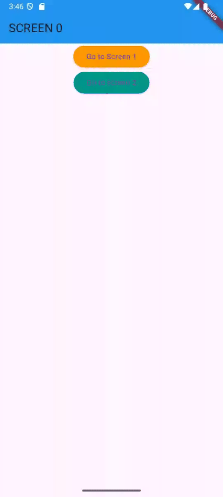

# 📱 Flutter Navigation Practice App

This is a simple Flutter application designed to practice and reinforce the fundamentals of **navigation between multiple screens** using **named routes** and **manual routing** with `MaterialPageRoute`.

---
## 📱 demonstration



## 🔍 Overview

The app consists of three screens:

- **Screen 0**  
  Initial screen with buttons to navigate to Screen 1 and Screen 2.

- **Screen 1**  
  A middle screen that can navigate to Screen 2.

- **Screen 2**  
  The final screen with a back button to return to the previous screen.

Each screen has:
- A unique `AppBar` color.
- Custom-styled buttons.
- Clean, simple layout using Flutter widgets.

---

## 💡 What I Learned & Practiced

### ✅ Flutter Navigation

- `Navigator.pushNamed()` for named route navigation.
- `Navigator.push()` with `MaterialPageRoute` for direct widget-based navigation.
- `Navigator.pop()` to return to previous screens.

### ✅ Widget Structure

- Built layouts using `StatelessWidget` and `Scaffold`.
- Nested widgets like `Center`, `Column`, and `ElevatedButton`.

### ✅ Styling & Theming

- Customized buttons with `ElevatedButton.styleFrom`.
- Applied distinct `AppBar` colors per screen to improve navigation clarity.

### ✅ Project Structure

- Split the app into multiple files (`main.dart`, `screen0.dart`, `screen1.dart`, `screen2.dart`).
- Used `initialRoute` and the `routes` map in `MaterialApp` for clean navigation control.

---
## 📱 Demonstração


## 🚀 How to Run

```bash
# Clone the repository
git clone https://github.com/your-username/flutter-navigation-practice.git
cd flutter-navigation-practice

# Run the app
flutter run

